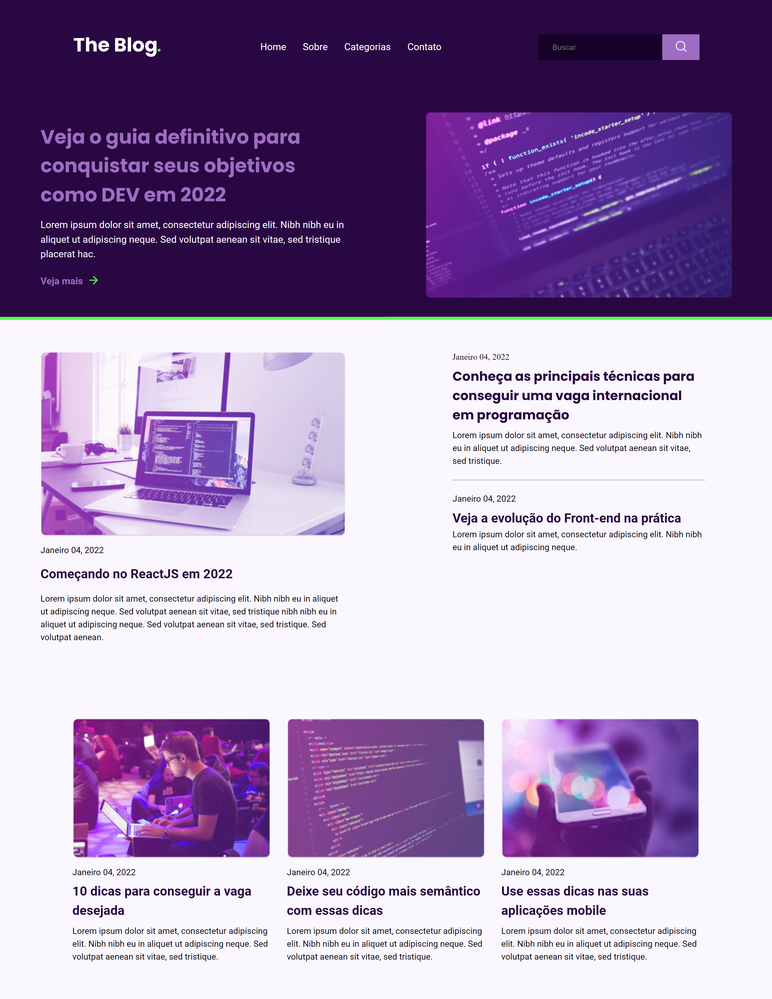

# RocketBlog

## Projeto 💻
Projeto de um desafio da Rocketseat de desenvolver uma homepage para um blog.

## Layout 🔖
Segue abaixo o layout deste projeto:
- [Figma](https://www.figma.com/file/eHyOuuSzJSQtdQ8Kek1jdi/DD-%2F-RocketBlog-(Copy)?t=4MxltUmuLliARIeg-6)

## Instalação 🛠
Siga esses passos para instalar o repositório na sua máquina:
1. Rode `git clone https://github.com/miishiyama/RocketBlog` para fazer um clone desse repositório.

## Tecnologias 🚀
As tecnologias utilizadas neste projeto são:
- HTML
- CSS
- Google Fonts

## Créditos ❤️
Feito por [Millene Eduarda Ishiyama](https://github.com/miishiyama/).
